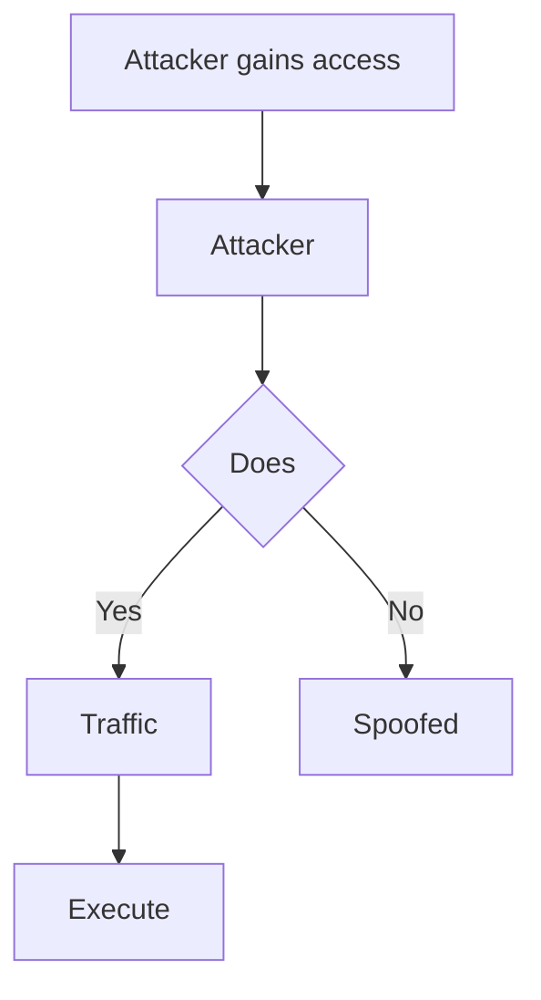

# Border Gateway Protocol (BGP) Hijacking

## When to Use
- When conducting highly advanced Red Team engagements involving physical infrastructure attacks, ISP-level threat simulation, or Nation-State adversary emulation.
- To demonstrate how an attacker can maliciously reroute entire blocks of IP addresses (subnets) globally by advertising false routing updates to internet backbone routers.
- *Note: True BGP hijacking requires access to a peered BGP router. This skill primarily focuses on the conceptual understanding, simulation, and defensive modeling of the attack.*


## Prerequisites
- Network access to the target subnet (VPN, pivot, or direct connection)
- Nmap and relevant network scanning tools installed
- Understanding of TCP/IP, common protocols, and network segmentation
- Root/admin access on the attack machine for raw socket operations

## Workflow

### Phase 1: Understanding BGP (The Concept)

```text
# Concept: The Internet is essentially a network of interconnecting networks (Autonomous Systems or AS).
# Border Gateway Protocol (BGP) is the "postal service" of the internet. It dynamically figures out 
# the most efficient path for data to travel from AS1 to AS99.

# Vulnerability: BGP was designed in the 1980s ```

### Phase 2: The Attack (Route Advertisement Spoofing)

```text
# Concept: An attacker controls a BGP router (e.g., AS666). They want to steal traffic destined 
# for a target bank (AS777) which owns the IP block 104.20.0.0/16.

# Step 1: The False Broadcast
# The attacker configures their router to announce to the world: "I am the best, quickest path to 104.20.0.0/24!"
# (Notice they announce a /24, which is a *more specific* route than the legitimate /16).

# Step 2: The Propagation
# BGP routers Step 3: The Intercept Global traffic ```

### Phase 3: Exploitation Techniques (What happens to the traffic?)

```text
# Strategy 1: The Blackhole (Denial of Service)
# The attacker Strategy 2: Man-in-the-Middle (Traffic Inspection)
# Strategy 3: DNS Hijacking ```

#### Decision Point 🔀


## 🔵 Blue Team Detection & Defense
- **RPKI (Resource Public Key Infrastructure)**: Implement **BGP Route Monitoring**: Utilize **Prefix Filtering**: ISPS Key Concepts
| Concept | Description |
|---------|-------------|
## Output Format
```
Bgp Hijacking Concepts — Assessment Report
============================================================
Target: [Target identifier]
Assessor: [Operator name]
Date: [Assessment date]
Scope: [Authorized scope]
MITRE ATT&CK: [Relevant technique IDs]

Findings Summary:
  [Finding 1]: [Severity] — [Brief description]
  [Finding 2]: [Severity] — [Brief description]

Detailed Results:
  Phase 1: [Phase name]
    - Result: [Outcome]
    - Evidence: [Screenshot/log reference]
    - Impact: [Business impact assessment]

  Phase 2: [Phase name]
    - Result: [Outcome]
    - Evidence: [Screenshot/log reference]
    - Impact: [Business impact assessment]

Risk Rating: [Critical/High/Medium/Low/Informational]
Recommendations:
  1. [Immediate remediation step]
  2. [Long-term hardening measure]
  3. [Monitoring/detection improvement]
```


## 📚 Shared Resources
> For cross-cutting methodology applicable to all vulnerability classes, see:
> - [`_shared/references/elite-chaining-strategy.md`](../_shared/references/elite-chaining-strategy.md) — Exploit chaining methodology and high-payout chain patterns
> - [`_shared/references/elite-report-writing.md`](../_shared/references/elite-report-writing.md) — HackerOne-optimized report writing, CWE quick reference
> - [`_shared/references/real-world-bounties.md`](../_shared/references/real-world-bounties.md) — Verified disclosed bounties by vulnerability class

## References
- Cloudflare: [What is BGP Hijacking?](https://www.cloudflare.com/learning/security/glossary/bgp-hijacking/)
- MANRS (Mutually Agreed Norms for Routing Security): [https://www.manrs.org/](https://www.manrs.org/)
- Internet Society: [BGP Security](https://www.internetsociety.org/issues/routing-security/)
